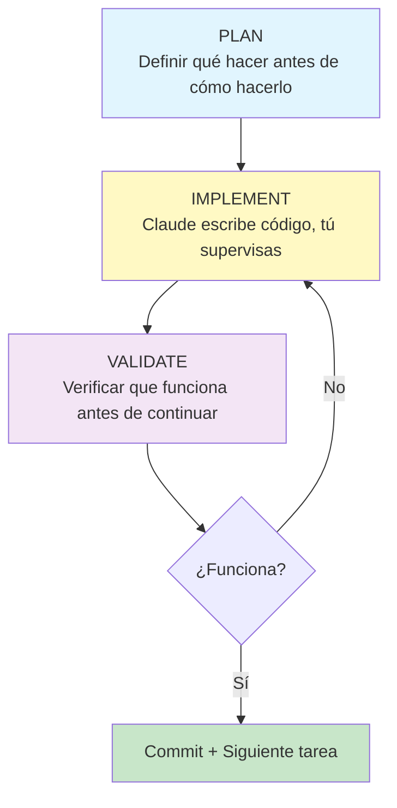

# Flujos de Trabajo con Claude Code

Este documento describe flujos de trabajo prácticos para desarrolladores que comienzan con Claude Code. Están inspirados en metodologías probadas como el [PIV loop de Cole Medin](https://gitnation.com/contents/advanced-claude-code-techniques-agentic-engineering-with-context-driven-development) y las [mejores prácticas de Addy Osmani](https://addyosmani.com/blog/ai-coding-workflow/).

---

## El Flujo PIV: Plan → Implement → Validate

Este es el flujo fundamental que deberías usar para cualquier tarea no trivial. La idea central es simple: **no escribas código hasta que sepas qué vas a escribir, y no des por terminado nada hasta que lo hayas verificado**.



---

## Flujo para Tareas Pequeñas (< 30 min)

Usa este flujo para bugs, cambios menores, o features simples que tocan 1-2 archivos.

### Paso 1: Describe el problema claramente

No empieces con "arregla esto". Tómate 30 segundos para escribir qué necesitas:

```
El botón de exportar CSV no funciona cuando el inventario está vacío.
Esperado: debería descargar un CSV con solo los headers.
Actual: no pasa nada, no hay error en consola.
```

### Paso 2: Pide a Claude que investigue primero

```
Antes de arreglar, analiza el código de exportación en @js/utils/export.js
y dime qué está pasando.
```

¿Por qué? Porque Claude a veces asume cosas incorrectas. Si primero lee y explica, puedes verificar que entiende el problema antes de que escriba código.

### Paso 3: Implementa

```
Arréglalo siguiendo el análisis que hiciste.
```

### Paso 4: Verifica

1. Lee el código que Claude modificó
2. Prueba el caso que fallaba (inventario vacío → exportar)
3. Prueba que no rompió el caso normal (inventario con datos → exportar)

### Paso 5: Commit

Si funciona, commit inmediato. No acumules cambios.

```
git add . && git commit -m "fix: export CSV works with empty inventory"
```

---

## Flujo para Features Medianas (30 min - 2 horas)

Usa este flujo para features nuevas que tocan múltiples archivos pero tienen alcance claro.

### Paso 1: Escribe qué quieres (mini-PRD)

Antes de hablar con Claude, escribe en un archivo o en el chat:

```markdown
## Feature: Indicador de stock bajo

### Objetivo
Mostrar visualmente cuando un producto tiene poco stock.

### Requisitos
1. Indicador rojo si stock < 5
2. Indicador amarillo si stock < 10
3. Tooltip al pasar el mouse

### Lo que NO incluye
- No cambia la lógica de inventario
- No añade alertas automáticas
```

El "lo que NO incluye" es importante. Evita que Claude se entusiasme y añada cosas que no pediste.

### Paso 2: Pide un plan

```
Aquí está lo que quiero implementar:

[pega el mini-PRD]

Antes de escribir código, analiza la estructura actual del proyecto
y proponme un plan de implementación.
```

Claude leerá archivos relevantes y propondrá:
- Qué archivos modificar
- Qué funciones crear
- Cómo integrar con el código existente

### Paso 3: Revisa y ajusta el plan

Lee el plan. ¿Tiene sentido? ¿Hay algo que harías diferente?

```
El plan se ve bien, pero en lugar de crear un nuevo archivo CSS,
añade los estilos al archivo existente styles/inventory.css
```

### Paso 4: Implementa en chunks

No pidas "implementa todo". Pide por partes:

```
Implementa el paso 1 del plan: la función que determina el nivel de stock.
```

Verifica que funciona. Luego:

```
Ahora implementa el paso 2: el componente visual del indicador.
```

### Paso 5: Verificación completa

1. Prueba cada caso:
   - Stock = 3 → indicador rojo
   - Stock = 8 → indicador amarillo
   - Stock = 15 → sin indicador
2. Prueba casos edge: stock = 0, stock = 5, stock = 10
3. Verifica que no rompiste nada existente

### Paso 6: Commit con mensaje descriptivo

```
git add . && git commit -m "feat: add low stock indicator to inventory list"
```

---

## Flujo para Features Grandes (> 2 horas)

Para features complejas, el flujo cambia: **divide antes de empezar**.

### Paso 1: Escribe el PRD completo

Para features grandes, un mini-PRD no basta. Escribe un documento más completo:

```markdown
# Feature: Sistema de categorías de productos

## Problema
Los usuarios no pueden organizar productos por categorías.
Con 100+ productos, la lista se vuelve difícil de manejar.

## Solución
Añadir sistema de categorías con filtrado.

## Requisitos funcionales
1. CRUD de categorías (crear, editar, eliminar)
2. Asignar categoría a producto (una categoría por producto)
3. Filtrar lista por categoría
4. Categoría "Sin categoría" para productos sin asignar

## Requisitos técnicos
- Persistir en localStorage junto con productos
- Mantener compatibilidad con datos existentes
- No romper exportación CSV

## Casos de uso detallados
1. Usuario crea categoría "Electrónicos"
2. Usuario asigna 5 productos a "Electrónicos"
3. Usuario filtra por "Electrónicos", ve solo esos 5
4. Usuario elimina categoría → productos pasan a "Sin categoría"

## Fuera de alcance
- Múltiples categorías por producto
- Subcategorías
- Importación de categorías desde CSV
```

### Paso 2: Pide a Claude que divida en tareas

```
Aquí está el PRD para una feature grande:

[pega el PRD]

Divídelo en tareas pequeñas que pueda implementar una por una.
Cada tarea debería ser completable en 30 minutos o menos.
Ordénalas por dependencias (qué necesito hacer primero).
```

Claude debería darte algo como:

1. Crear modelo de datos para categorías
2. Implementar persistencia en localStorage
3. UI: Sección de gestión de categorías
4. UI: Selector de categoría en formulario de producto
5. UI: Filtro de categorías en lista
6. Migración: productos existentes → "Sin categoría"
7. Integración: actualizar exportación CSV

### Paso 3: Una tarea = una sesión

Para cada tarea:
1. Nueva conversación (o `/clear`)
2. Aplica el flujo de features medianas
3. Verifica
4. Commit

### Paso 4: Integración final

Cuando todas las tareas estén completas:

```
Todas las partes del sistema de categorías están implementadas.
Haz una revisión final verificando que todo funciona junto.
```

---

## Principios Fundamentales

### 1. Contexto es rey

Claude trabaja mejor cuando entiende tu proyecto. Invierte tiempo en:

- **CLAUDE.md**: reglas del proyecto, convenciones, arquitectura
- **Referencias explícitas**: usa `@archivo.js` para que Claude lea lo que necesita
- **Ejemplos**: muéstrale código similar que ya funciona

### 2. Chunks pequeños > bloques grandes

Pedir "implementa toda la feature" produce código inconsistente. Pedir paso a paso produce código coherente que puedes verificar incrementalmente.

### 3. Verificación no es opcional

El 90% de los problemas con IA vienen de no verificar. Claude es muy bueno, pero comete errores. La verificación es lo que convierte "código generado" en "código de producción".

### 4. Commits frecuentes = puntos de salvación

Cada commit es un punto al que puedes volver. Si Claude rompe algo en la siguiente iteración, puedes revertir fácilmente.

### 5. Nueva conversación cuando el contexto se ensucia

Si llevas muchos mensajes y Claude empieza a "olvidar" cosas o dar respuestas genéricas, es momento de `/clear` y empezar fresco.

---

## Anti-patrones a Evitar

### ❌ "Vibe coding" sin dirección

```
hazme una app de inventario
```

Esto produce código que "funciona" pero que no entiendes ni puedes mantener.

### ❌ Confiar sin verificar

```
# Claude hizo cambios, asumo que están bien
git add . && git push
```

Esto es cómo introduces bugs en producción.

### ❌ Conversaciones interminables

Una conversación de 50+ mensajes donde hiciste 10 features diferentes es imposible de mantener. El contexto se degrada, Claude olvida cosas, tú olvidas qué se hizo.

### ❌ Implementar horizontal en vez de vertical

Mal:
1. Crear todos los modelos de datos
2. Crear todas las funciones
3. Crear toda la UI
4. Conectar todo

Bien:
1. Feature A completa (modelo + función + UI + tests)
2. Feature B completa (modelo + función + UI + tests)
3. Feature C completa...

El enfoque vertical te da algo funcional después de cada paso.

---

## Comandos Útiles en el Flujo

| Comando | Cuándo usarlo |
|---------|---------------|
| `/clear` | Al empezar una tarea nueva o cuando el contexto está sucio |
| `/status` | Para ver qué modelo estás usando |
| `/model` | Para cambiar de modelo según la complejidad |
| `@archivo` | Para referenciar archivos específicos |

---

## Ejemplo Completo: Bug Fix

Aquí está el flujo completo para arreglar un bug real.

**Problema reportado**: "El CSV exportado muestra caracteres raros en vez de ñ y acentos"

### 1. PLAN

```
Tengo un bug: el CSV exportado muestra caracteres raros en vez de ñ y acentos
cuando se abre en Excel en Windows.

Antes de arreglar, analiza @js/utils/export.js y explícame
qué encoding usa actualmente y por qué podría fallar en Windows Excel.
```

Claude responde explicando que falta el BOM (Byte Order Mark) que Excel necesita para detectar UTF-8.

### 2. IMPLEMENT

```
Entendido. Arregla el encoding añadiendo el BOM al inicio del archivo.
```

Claude modifica el archivo.

### 3. VALIDATE

1. Leo el código: veo que añadió `\uFEFF` al inicio del contenido
2. Abro `index.html`, creo un producto "Muñeca Niña"
3. Exporto CSV
4. Abro en Excel (o en editor hexadecimal verifico que tiene BOM)
5. Verifico que "Muñeca Niña" se ve correctamente

### 4. COMMIT

```bash
git add js/utils/export.js
git commit -m "fix: add UTF-8 BOM for Windows Excel compatibility"
```

---

## Recursos Adicionales

- [Claude Code Best Practices](https://www.anthropic.com/engineering/claude-code-best-practices) — Guía oficial de Anthropic
- [Context Engineering 101](https://gitnation.com/contents/advanced-claude-code-techniques-agentic-engineering-with-context-driven-development) — Workshop de Cole Medin
- [My LLM Coding Workflow](https://addyosmani.com/blog/ai-coding-workflow/) — Flujo de Addy Osmani

---

*Estos flujos son puntos de partida. Adáptalos a tu estilo y proyecto.*
