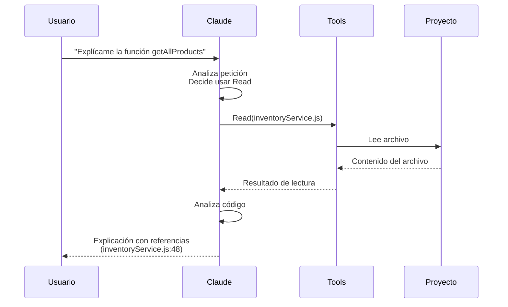
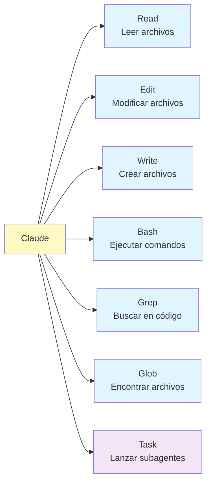
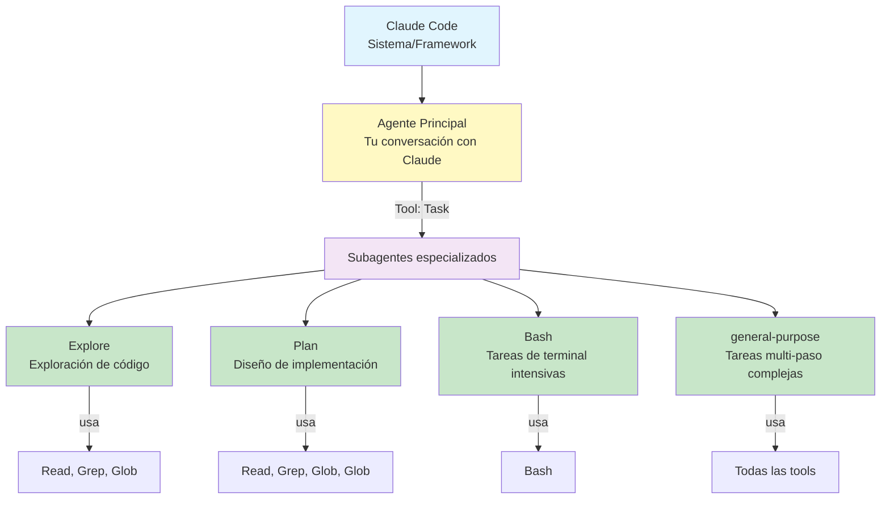

# Syllabus: Introducción a Claude Code

Este material te acompañará durante el curso y servirá como referencia después. Está diseñado para leerse de principio a fin, pero también puedes saltar a secciones específicas cuando lo necesites.

---

## 1. Instalación y Setup

Antes de empezar, necesitas tener tu entorno listo. La buena noticia es que el setup es sencillo y solo lo harás una vez.

### Lo que necesitas

Instala **VS Code** desde [code.visualstudio.com](https://code.visualstudio.com/) si aún no lo tienes. Luego, desde el marketplace de extensiones de VS Code, busca e instala la extensión **Claude Code**. Finalmente, necesitarás una cuenta de Anthropic que puedes crear en [claude.ai](https://claude.ai).

### Autenticación

Con todo instalado, abre VS Code y busca el panel de Claude Code en la barra lateral. Si ves "Login required", escribe `/login` en el chat. Esto abrirá un enlace en tu navegador donde autenticarás tu cuenta. Copia el token que te dan, pégalo en Claude Code, y estarás listo.

Una forma rápida de verificar que todo funciona: si ves el chat de Claude esperando tu mensaje, el setup está completo.

### Para este curso

Asegúrate de tener abierto el proyecto `proyecto-inventario`. Es una aplicación de inventario en HTML/JavaScript que usaremos para todos los ejercicios. Abre `index.html` en tu navegador y verifica que ves productos de ejemplo.

---

## 2. ¿Qué es Claude Code?

Esta es probablemente la pregunta más importante del curso, y la respuesta tiene matices que vale la pena entender desde el principio.

### La distinción que importa

**Claude Code no es un agente de IA.** Claude Code es un **sistema agéntico** — un framework, un CLI, el entorno donde las cosas suceden. Dentro de Claude Code corre **Claude**, el modelo de Anthropic, que sí actúa como agente.

¿Por qué importa esta distinción? Porque te ayuda a entender qué está pasando cuando trabajas:

- **Claude Code** es el sistema que orquesta todo: gestiona permisos, maneja archivos, coordina herramientas
- **Claude** es el "cerebro" que decide qué hacer y cómo hacerlo
- **El agente** es Claude cuando está ejecutando tareas con acceso a herramientas

### Qué es un agente de IA

Un modelo de lenguaje normal genera texto. Un agente va más allá: puede **ejecutar acciones** en el mundo real. En el caso de Claude dentro de Claude Code, esto significa:

- **Percibir**: leer tus archivos, ver la estructura de tu proyecto, revisar la terminal
- **Decidir**: determinar qué herramientas usar y en qué orden
- **Actuar**: modificar código, crear archivos, ejecutar comandos

Esto se conoce como **tool-calling** o **function-calling**. Cuando le pides algo a Claude, el modelo no solo genera una respuesta de texto — decide qué herramientas invocar para completar tu petición.



Este flujo muestra la diferencia clave: Claude no es solo un chatbot que responde preguntas — es un agente que puede ejecutar acciones en tu proyecto.

### Las herramientas disponibles

Claude tiene acceso a herramientas específicas dentro de Claude Code:

- **Read** para leer archivos de tu proyecto
- **Write** para crear archivos nuevos
- **Edit** para modificar archivos existentes
- **Bash** para ejecutar comandos en la terminal
- **Grep/Search** para buscar patrones en el código

Cuando le pides "explícame esta función", Claude usa Read. Cuando le pides "arregla este bug", usa Read para entender el problema y Edit para modificar el código.

### La arquitectura completa: Tools y Subagentes

Hay dos niveles de capacidades que es importante entender:

#### Nivel 1: Tools (Herramientas)

Claude tiene acceso directo a herramientas básicas para interactuar con tu código:



Cuando le pides "explícame esta función", Claude usa **Read**. Cuando le pides "arregla este bug", usa **Read** para entender el problema y **Edit** para modificar el código.

#### Nivel 2: Subagentes Especializados

Para tareas complejas, Claude puede lanzar **subagentes especializados** mediante la tool **Task**. Estos subagentes trabajan de forma autónoma y tienen acceso a su propio conjunto de tools:



**Ejemplo de subagentes en acción:**

Si le pides "explora cómo funciona la autenticación en este proyecto", Claude no hace todo el trabajo directamente. En su lugar, lanza un subagente **Explore** que está especializado en navegar y entender codebases grandes. Este subagente trabaja de forma autónoma — usa Glob para encontrar archivos relevantes, Grep para buscar patrones, Read para analizar el código — y cuando termina, devuelve un reporte estructurado al agente principal.

Otros subagentes incluyen:
- **Plan**: diseña estrategias de implementación antes de escribir código
- **Bash**: para tareas que requieren ejecución intensiva de comandos de terminal
- **general-purpose**: para tareas complejas multi-paso que requieren autonomía

**La diferencia clave:** Las tools son acciones directas (leer un archivo, ejecutar un comando). Los subagentes son agentes completos que usan esas tools de forma autónoma para completar objetivos complejos.

### Diferencia con ChatGPT

Si has usado ChatGPT para programar, conoces el flujo: abres ChatGPT en el navegador, copias código de tu editor, lo pegas, ChatGPT responde, copias la respuesta, la pegas de vuelta en tu editor. Es un loop constante de copy-paste.

Claude Code elimina ese loop completamente. Claude lee tus archivos directamente desde tu proyecto. Cuando genera código, lo escribe directamente en los archivos correctos. Tú supervisas y apruebas, pero no hay copy-paste manual.

Esta diferencia parece menor pero cambia fundamentalmente cómo trabajas. En lugar de ser un intermediario entre ChatGPT y tu código, te conviertes en un supervisor que dirige y valida.

### Otras herramientas similares

Claude Code no es la única herramienta en este espacio. **GitHub Copilot** ofrece autocompletado de código (originalmente basado en Codex) más un chat agéntico con GPT-4 llamado Copilot Chat. **Cursor** es un fork de VS Code con IA integrada que puede usar GPT-4, Claude, o ambos. **Windsurf** tiene un sistema agéntico llamado Cascade. **Aider** es una alternativa open source que funciona desde la terminal con múltiples modelos.

¿Cuál elegir? Depende de tu ecosistema, preferencias, y qué modelos prefieres. Este curso se centra en Claude Code, pero los conceptos de trabajo con agentes aplican a todas estas herramientas.

---

## 3. Primer Contacto

La mejor manera de entender Claude Code es usándolo. Vamos a hacer tu primera interacción.

### Tu primera pregunta

Con el proyecto `proyecto-inventario` abierto en VS Code, lanza Claude Code y escribe:

```
Explícame qué hace la función getAllProducts en js/services/inventoryService.js
```

Observa lo que pasa. No copiaste código. No pegaste nada. Claude **leyó el archivo directamente** de tu proyecto.

Cuando Claude responda, notarás referencias como `js/services/inventoryService.js:48`. Estas referencias son clicables — puedes hacer click y VS Code te llevará exactamente a esa línea. Esto es tool-calling en acción: Claude usó la herramienta Read para acceder al archivo, y la respuesta incluye referencias precisas al código.

### El shortcut @

Un truco útil: puedes referenciar archivos escribiendo `@` seguido del nombre. Por ejemplo:

```
Explícame @js/app.js
```

Esto le dice a Claude exactamente qué archivo mirar, sin ambigüedad.

### Explora libremente

Ahora es tu turno. Pregunta lo que quieras sobre el código del proyecto. Algunas ideas para empezar:

- "¿Cómo funciona la búsqueda de productos?"
- "¿Dónde se guardan los datos?"
- "¿Qué hace el botón de exportar?"

No te preocupes por "romper" nada — estamos solo leyendo y explorando. Claude te mostrará el código, explicará qué hace, y te dará referencias para profundizar.

---

## 4. CLAUDE.md: La Memoria del Proyecto

Cada proyecto tiene sus propias convenciones, reglas, y contexto que no son obvios mirando solo el código. CLAUDE.md es cómo le comunicas ese contexto a Claude.

### Qué es CLAUDE.md

Piensa en CLAUDE.md como un README, pero para Claude. Es un archivo donde defines:

- Reglas de código del proyecto (usar const/let en vez de var, por ejemplo)
- Convenciones del equipo (nombres de archivos, estructura de carpetas)
- Contexto arquitectónico (qué frameworks usas, cómo está organizado el código)
- Instrucciones específicas (idioma de respuestas, formato preferido)

Claude lee este archivo automáticamente al inicio de cada conversación y sigue las instrucciones que contiene.

**Tres niveles posibles**: Puedes tener CLAUDE.md a nivel de workspace global (`~/.claude/CLAUDE.md`), proyecto (raíz del repositorio), o directorio específico. Las instrucciones se aplican de más general a más específico. [Ver documentación oficial](https://docs.anthropic.com/en/docs/build-with-claude/claude-code/guide#claude-context-files).

### Creando tu CLAUDE.md

La forma más fácil de empezar es usando el comando `/init`. Claude analizará tu proyecto — mirará la estructura de archivos, el código existente, las dependencias — y generará un CLAUDE.md inicial con reglas apropiadas.

Pruébalo ahora:

```
/init
```

Revisa el archivo generado. Probablemente incluirá cosas como el lenguaje del proyecto, convenciones de estilo que detectó, y estructura general.

### Personalizando las reglas

El CLAUDE.md generado es un punto de partida. Puedes (y debes) personalizarlo. Por ejemplo, abre el archivo y añade:

```
Responde siempre en español.
```

A partir de ahora, Claude seguirá esa instrucción en todas las conversaciones de este proyecto.

Otras personalizaciones útiles:
- "No uses console.log en código de producción"
- "Prefiere funciones arrow sobre funciones tradicionales"
- "Los comentarios deben ser en inglés"
- "Usa TypeScript strict mode"

### Cuándo es útil

CLAUDE.md brilla cuando trabajas en proyectos con convenciones específicas, equipos con standards de código, o arquitecturas que no son obvias. No es necesario para scripts pequeños o exploraciones rápidas de código ajeno.

---

## 5. Modelos: Haiku, Sonnet y Opus

Claude Code te da acceso a tres modelos diferentes, cada uno con sus fortalezas. Saber cuándo usar cada uno te ahorra tiempo y dinero.

### Ver y cambiar modelos

Para ver qué modelos tienes disponibles y cuál estás usando:

```
/status
```

Para cambiar a otro modelo:

```
/model
```

### Cuándo usar cada modelo

**Haiku** es el modelo más rápido y económico. Úsalo para tareas simples donde no necesitas análisis profundo:

- "Explícame qué hace esta función"
- "Encuentra todas las referencias a localStorage en el proyecto"
- "Cambia el color del botón de azul a verde"

**Sonnet** es el modelo por defecto y el que usarás el 90% del tiempo. Tiene buen balance entre capacidad y velocidad:

- "Añade validación de email al formulario de registro"
- "Encuentra por qué falla la exportación cuando hay caracteres especiales"
- "Refactoriza inventoryService.js para usar async/await"

**Opus** es el modelo más capaz pero también el más lento y costoso. Resérvalo para tareas que realmente lo necesitan:

- "Diseña un sistema de autenticación con JWT para esta aplicación"
- "Reestructura toda la aplicación siguiendo el patrón MVC"
- "Haz un análisis profundo de seguridad de todo el código"

La regla general: empieza con Sonnet. Si la tarea es trivial, baja a Haiku. Si Sonnet no puede o la tarea es compleja arquitectónicamente, sube a Opus.

### Pegar imágenes

Un truco útil: puedes pegar screenshots directamente en el chat de Claude Code usando Ctrl+V (después de hacer una captura de pantalla). Esto es muy útil para:

- Mostrar errores de la consola del navegador
- Compartir un diseño que quieres implementar
- Reportar un bug visual que es difícil de describir con palabras

Claude analizará la imagen y responderá en contexto.

---

## 6. PRDs: Comunicación Efectiva

La calidad de lo que Claude produce depende directamente de la claridad de lo que le pides. Un PRD (Product Requirements Document) bien escrito puede ser la diferencia entre una implementación correcta a la primera y diez rondas de clarificaciones.

### El problema con prompts vagos

Considera esta petición:

```
Quiero exportar datos a CSV
```

¿Qué datos? ¿Qué columnas? ¿Qué formato de fecha? ¿UTF-8 o Latin-1? ¿Con BOM para Excel o sin él? ¿Cómo se llama el archivo? ¿Qué pasa si no hay datos?

Claude no puede leer tu mente. Si le das un prompt vago, te hará 5-10 preguntas para clarificar. Eso no es malo — es Claude siendo responsable — pero pierdes tiempo que podrías haber ahorrado.

### Un PRD que funciona

Compara con esto:

```markdown
# Feature: Exportación de Inventario a CSV

## Objetivo
Permitir exportar el inventario completo a formato CSV para análisis en hojas de cálculo.

## Requisitos Funcionales
1. Crear función que genera archivo CSV descargable
2. Columnas: ID, Nombre, Stock, Precio, Última Actualización
3. Formato: UTF-8 con BOM para compatibilidad con Windows Excel
4. Nombre del archivo: inventario_YYYY-MM-DD_HHmm.csv

## Casos de uso
- Usuario exporta inventario completo → descarga archivo CSV
- Inventario vacío → CSV con solo headers, sin filas de datos
- Producto con caracteres especiales (ñ, á, ü) → deben verse correctamente en Excel
```

Con este nivel de detalle, Claude puede implementar directamente. No hay ambigüedad, no hay preguntas, no hay ida y vuelta.

### El tiempo invertido se recupera

Escribir un buen PRD toma unos minutos extra. Pero esos minutos se recuperan (con creces) en menos iteraciones, menos correcciones, y código que hace exactamente lo que necesitas desde el principio.

### Guarda tus PRDs

Un tip práctico: crea una carpeta `docs/prds/` en tu proyecto y guarda ahí tus PRDs. Son documentación útil del proyecto y puedes reutilizarlos o adaptarlos para features similares en el futuro.

---

## 7. Plan Mode: Diseña Antes de Codear

Para tareas simples, puedes pedirle a Claude que implemente directamente. Pero para tareas complejas, hay una estrategia mejor: pedir un plan primero.

### Por qué planear

Cuando Claude implementa directamente una tarea compleja, puede tomar decisiones arquitectónicas que no te gustan. Y una vez que el código está escrito, cambiar esas decisiones cuesta — tanto en tiempo como en tokens.

Plan Mode invierte el proceso: primero Claude analiza el código existente, propone un enfoque, y espera tu aprobación antes de escribir una sola línea.

### Ejemplo práctico

Supongamos que quieres agregar un sistema de roles (Admin, User, Guest) al proyecto. En lugar de:

```
Añade un sistema de roles al proyecto
```

Prueba con:

```
Quiero agregar un sistema de roles (Admin, User, Guest) al proyecto.
Antes de implementar, analiza el código actual (especialmente js/services/inventoryService.js y js/app.js) y proponme un plan detallado.
```

Claude entrará en modo exploración. Leerá los archivos relevantes, analizará la arquitectura actual, y propondrá un plan: qué archivos modificar, qué funciones crear, cómo integrar con el código existente.

Tú revisas el plan. Si algo no te gusta, lo ajustas:

```
En lugar de guardar roles en localStorage, usa un objeto de configuración hardcodeado en el JS
```

Claude ajusta el plan. Y solo cuando estés satisfecho con el diseño, le dices que implemente.

### Cuándo usar Plan Mode

No todo necesita planificación. Usa Plan Mode cuando:

- La feature toca múltiples archivos
- Hay decisiones arquitectónicas que tomar
- No estás seguro del mejor enfoque
- El cambio es difícil de revertir

Para cambios pequeños y obvios (cambiar un color, añadir un campo), implementación directa está bien.

---

## 8. Verificación: Nunca Confíes Ciegamente

Este es quizás el mensaje más importante del curso: **Claude comete errores**. Es muy bueno, pero no es perfecto. Y tú eres responsable del código que termina en tu proyecto.

### Los errores que Claude comete

Claude puede:
- Importar módulos que no existen en tu proyecto
- Asumir una estructura de datos que no es la real
- Olvidar casos edge que no mencionaste
- Usar sintaxis incorrecta en lenguajes que conoce menos bien
- Introducir bugs sutiles que funcionan en casos normales pero fallan en casos límite

Esto no es una crítica a Claude — es la realidad de trabajar con cualquier herramienta de generación de código.

### Tres niveles de verificación

**Nivel 1: Lee el código**

Lo mínimo que debes hacer es leer el código que Claude generó. No lo copies ciegamente a producción. Entiende qué hace, por qué lo hace así, y si tiene sentido para tu caso.

**Nivel 2: Prueba manualmente**

Mejor aún: prueba que funciona. Si Claude añadió un botón, haz click en él. Si arregló un bug, reproduce el escenario que fallaba y verifica que ahora funciona.

**Nivel 3: Tests automatizados**

Lo ideal para código crítico: escribe tests (o pídele a Claude que los escriba). Los tests atrapan regresiones y documentan el comportamiento esperado.

### Ejercicio: Practica la verificación

Pide a Claude que haga un cambio en el proyecto. Luego:

1. Lee el código modificado
2. Abre `index.html` en el navegador
3. Verifica manualmente que el cambio funciona
4. Piensa en casos edge: ¿qué pasa si...?

La verificación debería ser automática, parte de tu flujo de trabajo con cualquier herramienta de IA.

---

## 9. Skills: Automatiza lo Repetitivo

Si te encuentras dando las mismas instrucciones a Claude una y otra vez, los skills son tu solución.

### Qué son los skills

Los skills son comandos personalizados que puedes crear para automatizar tareas repetitivas. En lugar de escribir un prompt largo cada vez, creas un skill una vez y lo invocas con un comando corto.

### Ver skills disponibles

```
/skills
```

### Crear tu propio skill

Los skills viven en la carpeta `.claude/commands/` de tu proyecto. Cada skill es un archivo Markdown con un formato específico.

Por ejemplo, para crear un skill que refactoriza código legacy:

1. Crea la carpeta si no existe:
```bash
mkdir -p .claude/commands
```

2. Crea el archivo `.claude/commands/fix-legacy.md`:

```markdown
---
name: fix-legacy
description: Refactoriza código legacy a ES6+
---

Analiza el código y encuentra patrones legacy como:
- Uso de 'var' en lugar de const/let
- Funciones anónimas en lugar de arrow functions
- Callbacks en lugar de async/await
- Nombres de variables poco descriptivos

Refactoriza a código moderno ES6+:
- Usa const por defecto, let solo cuando necesites reasignar
- Prefiere arrow functions para callbacks
- Usa async/await donde sea posible
- Mejora nombres de variables para que sean descriptivos

Mantén la misma funcionalidad. No cambies la lógica, solo moderniza la sintaxis.
```

3. Usa el skill:
```
/fix-legacy
```

Claude seguirá las instrucciones del skill automáticamente.

### Ideas de skills útiles

Algunos skills que podrías crear:

- `/review` — hace code review del archivo actual señalando problemas
- `/explain` — explica qué hace el código con diferentes niveles de detalle
- `/add-tests` — genera tests unitarios para el código seleccionado
- `/docs` — genera documentación JSDoc o similar
- `/security` — busca vulnerabilidades comunes en el código

---

## 10. Gestión de Contexto

Claude tiene un límite de contexto de 200K tokens. Parece mucho, pero cuando le pides que lea múltiples archivos, analice el proyecto, y luego tengas una conversación larga... se llena.

### Señales de que el contexto se está llenando

- Claude "olvida" cosas que dijiste antes en la conversación
- Las respuestas se vuelven más genéricas, menos específicas a tu código
- Empiezas a ver errores de "context too long"

### Qué hacer

**Nueva conversación por feature** es la mejor práctica. En lugar de una conversación gigante donde haces todo, inicia conversaciones separadas para cada tarea significativa. Terminas la feature de exportación, `/clear`, empiezas la feature de búsqueda.

**/clear** limpia la conversación actual. Útil cuando sientes que Claude está perdiendo el hilo.

**/compact** comprime el contexto, aunque no siempre es recomendable porque puede perder información importante.

### La regla práctica

Si empiezas a notar que Claude no recuerda lo que dijiste hace 10 mensajes, probablemente es momento de una nueva conversación.

---

## 11. Flujo Completo Profesional

Todo lo que has aprendido se integra en un flujo de trabajo: **PRD → Plan → Implementación → Verificación**.

> **📚 Lectura recomendada**: Para profundizar en flujos de trabajo prácticos con ejemplos detallados, consulta [Flujos de trabajo.md](./Flujos%20de%20trabajo.md). Este documento describe el flujo PIV (Plan → Implement → Validate) y patrones específicos para tareas pequeñas, medianas y grandes.

### El flujo en acción

**1. Documenta lo que necesitas (PRD)**

Antes de tocar Claude, escribe qué quieres. No tiene que ser formal, pero sí claro:

```markdown
# Feature: Alerta de Stock Bajo

## Objetivo
Mostrar indicador visual cuando un producto tiene poco stock.

## Requisitos
1. Indicador visual en la lista de productos
2. Rojo para stock < 5, amarillo para stock < 10
3. Tooltip con mensaje "Stock bajo" al pasar el mouse

## Casos de uso
- Stock = 3: indicador rojo
- Stock = 8: indicador amarillo
- Stock = 15: sin indicador
```

**2. Pide el plan**

```
Analiza el código actual y proponme un plan para implementar esto
```

Claude explorará el código, entenderá la estructura, y propondrá cómo implementar la feature.

**3. Revisa y ajusta el plan**

¿El plan tiene sentido? ¿Hay algo que cambiarías? Este es el momento de ajustar, antes de escribir código.

**4. Implementa**

```
Implementa el plan
```

Claude escribe el código.

**5. Verifica**

Abre `index.html`, crea productos con diferentes niveles de stock, verifica que los indicadores aparecen correctamente.

### Por qué funciona

Este flujo te da control en cada paso. No estás a merced de lo que Claude decida hacer — tú defines qué, revisas cómo, y verificas que funciona.

---

## 12. Principios Clave

Si olvidas todo lo demás, recuerda estos cinco principios:

1. **Prompt claro = menos iteraciones.** El tiempo que inviertes escribiendo un buen PRD se recupera en menos ida y vuelta.

2. **Planea antes de codear.** Para tareas no triviales, pide un plan primero. Es más barato ajustar un plan que reescribir código.

3. **Siempre verifica.** Claude es muy bueno, pero comete errores. Lee el código, prueba manualmente, considera casos edge.

4. **Nueva conversación por feature.** El contexto se llena. Conversaciones enfocadas funcionan mejor que una conversación interminable.

5. **Tú eres responsable del código.** Claude es una herramienta, no un reemplazo de tu criterio. El código que termina en producción es tu responsabilidad.

---

## 13. Próximos Pasos

Este curso te llevó del nivel "ChatGPT con copy-paste" al nivel "Claude Code integrado en tu flujo de trabajo". Hay más niveles por explorar.

### La escalera de evolución

**Nivel 1 — ChatGPT con copy-paste**: donde probablemente empezaste. Funciona, pero es lento y tedioso.

**Nivel 2 — Claude Code integrado**: donde estás ahora. Sin copy-paste, herramientas integradas, flujo profesional.

**Nivel 3 — Agentes personalizados**: con algo de código (unas 50 líneas), puedes crear agentes especializados que ejecutan herramientas reales y devuelven resultados estructurados. Típicamente después de 1-3 meses de práctica con Claude Code.

**Nivel 4 — PRPs y documentación exhaustiva**: nivel avanzado donde documentas tu codebase de forma tan completa que Claude puede implementar features correctamente a la primera. Requiere disciplina pero multiplica tu productividad.

### Qué hacer mañana

Elige **una** cosa para practicar:

- [ ] Usa Claude para entender código de un proyecto que no conoces bien
- [ ] Crea un CLAUDE.md para tu proyecto personal
- [ ] Usa Claude para un refactoring pequeño y verifica el resultado

No intentes aplicar todo a la vez. Incorpora Claude a tu flujo gradualmente.

### Recursos

- [Documentación oficial de Claude Code](https://docs.anthropic.com/claude-code)
- [Claude Code Best Practices](https://www.anthropic.com/engineering/claude-code-best-practices) — tips del equipo de Anthropic
- [Claude Code in Action](https://anthropic.skilljar.com/claude-code-in-action) — curso oficial de Anthropic
- Proyecto de práctica: `proyecto-inventario`

---

*Syllabus del curso de Introducción a Claude Code*
